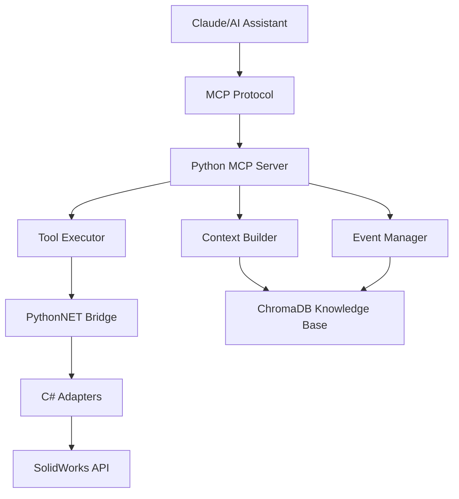

# SolidWorks MCP Server

A comprehensive Model Context Protocol (MCP) server that bridges SolidWorks CAD automation with AI assistants like Claude. This server provides full access to SolidWorks functionality through a standardized protocol, enabling AI-powered design automation, analysis, and optimization.

## 🚀 Features

### Core Capabilities
- **Multi-Version Support**: Compatible with SolidWorks 2021-2025
- **Full API Coverage**: Access to all major SolidWorks operations
- **Design Table Integration**: Read/write Excel-based design tables
- **VBA Macro Execution**: Run and manage VBA macros with parameters
- **AI Knowledge Base**: ChromaDB integration for learning from operations
- **Real-time Events**: Capture and respond to SolidWorks events
- **Async Operations**: Non-blocking execution for better performance

### Supported Operations
- ✅ Open/close models (parts, assemblies, drawings)
- ✅ Feature manipulation (create, modify, suppress)
- ✅ Dimension control and parametric updates
- ✅ Design table management
- ✅ Configuration switching and management
- ✅ Mass properties calculation
- ✅ Custom properties read/write
- ✅ Multi-format export (STEP, IGES, STL, PDF, DXF, DWG)
- ✅ Screenshot capture
- ✅ VBA macro execution
- ✅ Model rebuild and validation
- ✅ Drawing creation from models

### AI-Powered Features
- 🧠 **Intelligent Context Building**: Provides comprehensive model context to AI
- 📚 **Knowledge Accumulation**: Learns from every operation via ChromaDB
- 🔍 **Pattern Recognition**: Identifies and suggests design patterns
- 🛠️ **Error Resolution**: Stores solutions to common problems
- 💡 **Design Optimization**: AI-assisted optimization suggestions
- 🎯 **Variant Generation**: Automated creation of design variants

## 🏗️ Architecture



### Key Components

1. **MCP Server** (`src/mcp_host/server.py`)
   - Implements the Model Context Protocol
   - Handles tool execution and prompt generation
   - Manages resource discovery

2. **C# Adapters** (`src/solidworks_adapters/`)
   - Version-specific implementations (2021-2025)
   - Direct COM interface to SolidWorks
   - Async/await support via PythonNET

3. **Knowledge Base** (`src/context_builder/knowledge_base.py`)
   - ChromaDB for semantic search
   - Stores operations, patterns, errors, and solutions
   - Enables learning from past actions

4. **Event System** (`src/events/event_manager.py`)
   - Real-time event capture
   - Event-driven automation
   - Comprehensive logging

## 📋 Prerequisites

- **SolidWorks** 2021-2025 (licensed installation)
- **Python** 3.9 or higher
- **.NET Framework** 4.8 or higher
- **Docker** (optional, for ChromaDB)
- **Windows OS** (SolidWorks requirement)

## 🛠️ Installation

### 1. Clone the Repository
```bash
git clone https://github.com/yourusername/mcp-server-solidworks.git
cd mcp-server-solidworks
```

### 2. Set Up Python Environment
```bash
python -m venv venv
venv\Scripts\activate  # On Windows
pip install -e .
```

### 3. Configure Environment
Copy `.env.example` to `.env` and update:
```env
SOLIDWORKS_PATH=C:/Program Files/SOLIDWORKS Corp/SOLIDWORKS
SOLIDWORKS_VERSION=2024
CHROMA_PORT=8057
```

### 4. Build C# Adapters
```bash
python scripts/build_adapters.py
```

### 5. Start ChromaDB (Optional but Recommended)
```bash
docker-compose up -d chromadb
```

### 6. Verify Installation
```bash
python scripts/test_installation.py
```

## 🚀 Quick Start

### Starting the Server

#### Standalone Mode
```bash
python -m src.mcp_host.server
```

#### With Docker
```bash
docker-compose up
```

### Configure Claude Desktop

Add to `claude_desktop_config.json`:
```json
{
  "mcpServers": {
    "solidworks": {
      "command": "python",
      "args": ["-m", "src.mcp_host.server"],
      "cwd": "C:/path/to/mcp-server-solidworks"
    }
  }
}
```

## 💻 Usage Examples

### Basic Operations

```python
# Open a model
await mcp.call_tool("open_model", {
    "file_path": "C:/Models/bracket.sldprt"
})

# Modify a dimension
await mcp.call_tool("modify_dimension", {
    "feature_name": "Boss-Extrude1",
    "dimension_name": "D1@Boss-Extrude1",
    "value": 25.0
})

# Update design table
await mcp.call_tool("update_design_table", {
    "table_name": "Design Table",
    "configuration": "Large",
    "values": {
        "Length": 150,
        "Width": 100,
        "Thickness": 10
    }
})

# Export model
await mcp.call_tool("export_model", {
    "output_path": "C:/Exports/bracket.step",
    "format": "STEP"
})
```

### AI-Powered Analysis

```python
# Analyze model
response = await mcp.get_prompt("analyze_model", {
    "file_path": "C:/Models/complex_assembly.sldasm"
})

# Optimize design
response = await mcp.get_prompt("optimize_design", {
    "optimization_goal": "reduce weight while maintaining strength"
})

# Generate variants
response = await mcp.get_prompt("create_variants", {
    "parameters": ["length", "hole_count", "thickness"],
    "count": 5
})
```

### VBA Macro Integration

```python
# Run a simple macro
await mcp.call_tool("run_macro", {
    "macro_path": "C:/Macros/CreateDrawing.swp",
    "macro_name": "main"
})

# Run macro with parameters
await mcp.call_tool("run_macro", {
    "macro_path": "C:/Macros/BatchProcess.swp",
    "parameters": {
        "operation": "add_watermark",
        "text": "CONFIDENTIAL"
    }
})
```

## 🧪 Testing

Run the test suite:
```bash
pytest tests/ -v
```

Run specific tests:
```bash
pytest tests/test_server.py::TestMCPServer -v
```

## 🐳 Docker Support

The project includes full Docker support with ChromaDB integration:

```bash
# Start all services
docker-compose up

# Start only ChromaDB
docker-compose up chromadb

# View logs
docker-compose logs -f mcp-server
```

ChromaDB runs on port **8057** to avoid conflicts with other instances.

## 📚 Documentation

- [Installation Guide](INSTALLATION.md) - Detailed setup instructions
- [API Reference](docs/API.md) - Complete tool documentation
- [Contributing Guide](CONTRIBUTING.md) - How to contribute
- [Examples](examples/) - Usage examples and patterns

## 🔧 Configuration

### Environment Variables

| Variable | Description | Default |
|----------|-------------|---------|
| `SOLIDWORKS_PATH` | SolidWorks installation path | `C:/Program Files/SOLIDWORKS Corp/SOLIDWORKS` |
| `SOLIDWORKS_VERSION` | Default SW version | `2024` |
| `CHROMA_PORT` | ChromaDB port | `8057` |
| `MCP_LOG_LEVEL` | Logging level | `INFO` |
| `ENABLE_CHROMADB` | Enable knowledge base | `true` |

### Feature Flags

Control features via `.env`:
- `ENABLE_EVENT_CAPTURE` - Real-time event monitoring
- `ENABLE_PERFORMANCE_METRICS` - Performance tracking
- `ENABLE_AUTO_SAVE` - Automatic model saving
- `SANDBOX_VBA_EXECUTION` - Sandbox VBA macros

## 🤝 Contributing

We welcome contributions! Areas of interest:

- ✨ New SolidWorks operations
- 🧠 Improved AI prompts and context
- 🧪 Additional test coverage
- 🔧 Performance optimizations
- 📚 Documentation improvements
- 🌍 Multi-language support

See [CONTRIBUTING.md](CONTRIBUTING.md) for guidelines.

## 🔒 Security

- All file operations are sandboxed
- VBA macro execution can be restricted
- API authentication support
- Audit logging for compliance

## 📊 Performance

- Async operations throughout
- Connection pooling for ChromaDB
- Intelligent caching of model data
- Batch operations support
- Event debouncing

## 🐛 Troubleshooting

### Common Issues

1. **"SolidWorks not found"**
   - Ensure SolidWorks is installed
   - Set `SOLIDWORKS_PATH` environment variable

2. **"C# adapter build failed"**
   - Install .NET SDK
   - Copy SolidWorks API DLLs to `references/`

3. **"ChromaDB connection failed"**
   - Ensure Docker is running
   - Check port 8057 is available

See [Troubleshooting Guide](docs/TROUBLESHOOTING.md) for more.

## 📄 License

This project is licensed under the MIT License - see [LICENSE](LICENSE) file.

## 🙏 Acknowledgments

- SolidWorks API documentation
- MCP protocol specification
- ChromaDB for vector storage
- PythonNET for C# interop

## 📞 Support

- **Issues**: [GitHub Issues](https://github.com/yourusername/mcp-server-solidworks/issues)
- **Discussions**: [GitHub Discussions](https://github.com/yourusername/mcp-server-solidworks/discussions)
- **Email**: support@example.com

---

Built with ❤️ for the SolidWorks community