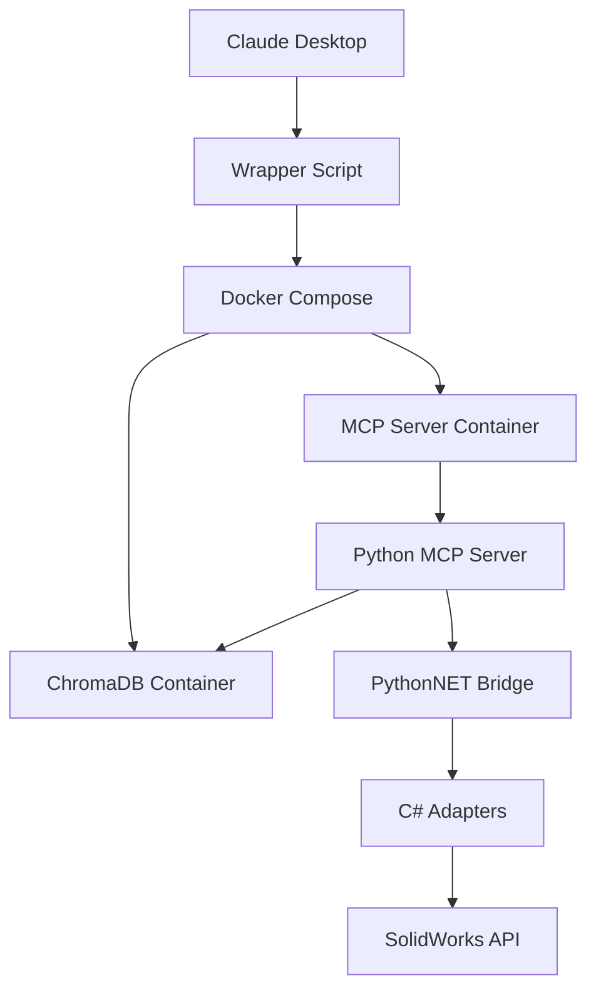

# SolidWorks MCP Server

A comprehensive Model Context Protocol (MCP) server that bridges SolidWorks CAD automation with AI assistants like Claude. This server provides full access to SolidWorks functionality through a standardized protocol, enabling AI-powered design automation, analysis, and optimization.

## 🚀 Features

### Core Capabilities
- **Multi-Version Support**: Compatible with SolidWorks 2021-2025
- **Full API Coverage**: Access to all major SolidWorks operations
- **Design Table Integration**: Read/write Excel-based design tables
- **VBA Macro Execution**: Run and manage VBA macros with parameters
- **AI Knowledge Base**: ChromaDB integration for learning from operations
- **Real-time Events**: Capture and respond to SolidWorks events
- **Async Operations**: Non-blocking execution for better performance

### Supported Operations
- ✅ Open/close models (parts, assemblies, drawings)
- ✅ Feature manipulation (create, modify, suppress)
- ✅ Dimension control and parametric updates
- ✅ Design table management
- ✅ Configuration switching and management
- ✅ Mass properties calculation
- ✅ Custom properties read/write
- ✅ Multi-format export (STEP, IGES, STL, PDF, DXF, DWG)
- ✅ Screenshot capture
- ✅ VBA macro execution
- ✅ Model rebuild and validation
- ✅ Drawing creation from models

### AI-Powered Features
- 🧠 **Intelligent Context Building**: Provides comprehensive model context to AI
- 📚 **Knowledge Accumulation**: Learns from every operation via ChromaDB
- 🔍 **Pattern Recognition**: Identifies and suggests design patterns
- 🛠️ **Error Resolution**: Stores solutions to common problems
- 💡 **Design Optimization**: AI-assisted optimization suggestions
- 🎯 **Variant Generation**: Automated creation of design variants

## 📋 Prerequisites

- **SolidWorks** 2021-2025 (licensed installation)
- **Docker Desktop** (required)
- **Windows OS** (SolidWorks requirement)

## 🛠️ Quick Start

### 1. Clone the Repository
```bash
git clone https://github.com/yourusername/mcp-server-solidworks.git
cd mcp-server-solidworks
```

### 2. Configure Environment
Copy `.env.example` to `.env` and update your SolidWorks paths:
```bash
cp .env.example .env
# Edit .env with your paths
```

### 3. Start Services
```bash
# Start all services
docker-compose up -d

# Verify services are running
docker-compose ps
```

### 4. Configure Claude Desktop

Add to your Claude Desktop configuration file:

**Windows** (`%APPDATA%\Claude\claude_desktop_config.json`):
```json
{
  "mcpServers": {
    "solidworks": {
      "command": "C:\\path\\to\\mcp-server-solidworks\\mcp-server-solidworks.bat"
    }
  }
}
```

**macOS/Linux** (`~/Library/Application Support/Claude/claude_desktop_config.json`):
```json
{
  "mcpServers": {
    "solidworks": {
      "command": "/path/to/mcp-server-solidworks/mcp-server-solidworks.sh"
    }
  }
}
```

That's it! The wrapper script automatically ensures Docker services are running and connects Claude to the MCP server.

## 🚀 Usage

### Docker Commands

```bash
# Start services
docker-compose up -d

# Stop services
docker-compose down

# View logs
docker-compose logs -f

# Restart services
docker-compose restart

# Check status
docker-compose ps
```

### Using Make (Optional)

If you have Make installed:
```bash
make up      # Start services
make down    # Stop services
make logs    # View logs
make shell   # Open shell in container
make test    # Run tests
```

## 💻 Usage Examples

Once configured, you can ask Claude to:

### Basic Operations

"Open the bracket model at C:/Models/bracket.sldprt"

"Change the Boss-Extrude1 depth to 25mm"

"Update the design table Large configuration with Length=150, Width=100"

"Export the current model as STEP to C:/Exports/"

### AI-Powered Analysis

"Analyze this assembly and suggest weight reduction opportunities"

"Generate 5 variants of this part with different hole patterns"

"What are the potential manufacturing issues with this design?"

### VBA Automation

"Run the CreateDrawing macro"

"Execute the batch processing macro with watermark text 'CONFIDENTIAL'"

## 🐳 Docker Architecture

The project uses Docker Compose with two main services:

1. **mcp-server**: Python MCP server with all dependencies
2. **chromadb**: Vector database on port 8057 for knowledge storage

Optional development services:
- **dev-tools**: Development container (use `--profile dev`)
- **jupyter**: Jupyter Lab on port 8888 (use `--profile jupyter`)

## 🧪 Development

### Development Workflow

```bash
# Open shell in container
docker-compose exec mcp-server bash

# Run tests
docker-compose exec mcp-server pytest tests/

# Format code
docker-compose exec mcp-server black src/

# Start Jupyter notebook
docker-compose --profile jupyter up -d jupyter
```

### Building C# Adapters

```bash
docker-compose exec mcp-server python scripts/build_adapters.py
```

## 📊 Knowledge Base

The ChromaDB knowledge base learns from every operation:

### View Knowledge Statistics
```bash
docker-compose exec mcp-server python -c "
from src.context_builder.knowledge_base import SolidWorksKnowledgeBase
kb = SolidWorksKnowledgeBase()
stats = kb.analyze_operation_patterns()
print(f'Total operations: {stats[\"total_operations\"]}')
print(f'Success rate: {stats[\"success_rate\"]:.1%}')
"
```

### Export Knowledge
```bash
docker-compose exec mcp-server python -c "
from src.context_builder.knowledge_base import SolidWorksKnowledgeBase
kb = SolidWorksKnowledgeBase()
kb.export_knowledge('/app/data/knowledge_export.json')
"
```

## 🔧 Configuration

### Environment Variables

Key settings in `.env`:

| Variable | Description | Default |
|----------|-------------|---------|
| `SOLIDWORKS_PATH` | SolidWorks installation | `C:/Program Files/SOLIDWORKS Corp/SOLIDWORKS` |
| `SOLIDWORKS_VERSION` | Default version | `2024` |
| `SOLIDWORKS_MODELS_PATH` | Models directory | `C:/SolidWorks/Models` |
| `SOLIDWORKS_MACROS_PATH` | Macros directory | `C:/SolidWorks/Macros` |

### Ports

- **8057**: ChromaDB (vector database)
- **8888**: Jupyter Lab (optional, development)

## 🐛 Troubleshooting

### Common Issues

1. **"Cannot connect to Docker"**
   - Ensure Docker Desktop is running
   - On Windows, verify Docker is using Linux containers

2. **"SolidWorks paths not found"**
   - Update paths in `.env` file
   - Use forward slashes: `C:/SolidWorks/Models`

3. **"Port already in use"**
   ```bash
   # Find process using port 8057
   netstat -an | findstr 8057  # Windows
   lsof -i :8057              # macOS/Linux
   ```

4. **View detailed logs**
   ```bash
   docker-compose logs -f mcp-server
   docker-compose logs -f chromadb
   ```

## 🏗️ Architecture



## 📄 License

This project is licensed under the MIT License - see [LICENSE](LICENSE) file.

## 🙏 Acknowledgments

- SolidWorks API documentation
- MCP protocol specification
- ChromaDB for vector storage
- PythonNET for C# interop

## 📞 Support

- **Issues**: [GitHub Issues](https://github.com/yourusername/mcp-server-solidworks/issues)
- **Discussions**: [GitHub Discussions](https://github.com/yourusername/mcp-server-solidworks/discussions)

---

Built with ❤️ for the SolidWorks community