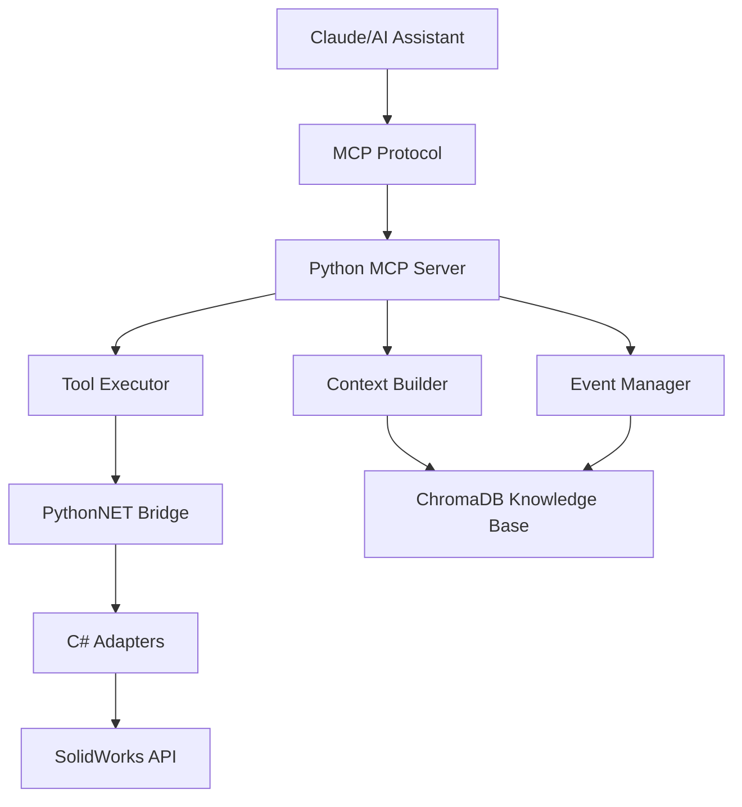

# SolidWorks MCP Server

A comprehensive Model Context Protocol (MCP) server that bridges SolidWorks CAD automation with AI assistants like Claude. This server provides full access to SolidWorks functionality through a standardized protocol, enabling AI-powered design automation, analysis, and optimization.

## 🚀 Features

### Core Capabilities
- **Multi-Version Support**: Compatible with SolidWorks 2021-2025
- **Full API Coverage**: Access to all major SolidWorks operations
- **Design Table Integration**: Read/write Excel-based design tables
- **VBA Macro Execution**: Run and manage VBA macros with parameters
- **AI Knowledge Base**: ChromaDB integration for learning from operations
- **Real-time Events**: Capture and respond to SolidWorks events
- **Async Operations**: Non-blocking execution for better performance

### Supported Operations
- ✅ Open/close models (parts, assemblies, drawings)
- ✅ Feature manipulation (create, modify, suppress)
- ✅ Dimension control and parametric updates
- ✅ Design table management
- ✅ Configuration switching and management
- ✅ Mass properties calculation
- ✅ Custom properties read/write
- ✅ Multi-format export (STEP, IGES, STL, PDF, DXF, DWG)
- ✅ Screenshot capture
- ✅ VBA macro execution
- ✅ Model rebuild and validation
- ✅ Drawing creation from models

### AI-Powered Features
- 🧠 **Intelligent Context Building**: Provides comprehensive model context to AI
- 📚 **Knowledge Accumulation**: Learns from every operation via ChromaDB
- 🔍 **Pattern Recognition**: Identifies and suggests design patterns
- 🛠️ **Error Resolution**: Stores solutions to common problems
- 💡 **Design Optimization**: AI-assisted optimization suggestions
- 🎯 **Variant Generation**: Automated creation of design variants

## 🏗️ Architecture



### Key Components

1. **MCP Server** (`src/mcp_host/server.py`)
   - Implements the Model Context Protocol
   - Handles tool execution and prompt generation
   - Manages resource discovery

2. **C# Adapters** (`src/solidworks_adapters/`)
   - Version-specific implementations (2021-2025)
   - Direct COM interface to SolidWorks
   - Async/await support via PythonNET

3. **Knowledge Base** (`src/context_builder/knowledge_base.py`)
   - ChromaDB for semantic search
   - Stores operations, patterns, errors, and solutions
   - Enables learning from past actions

4. **Event System** (`src/events/event_manager.py`)
   - Real-time event capture
   - Event-driven automation
   - Comprehensive logging

## 📋 Prerequisites

- **SolidWorks** 2021-2025 (licensed installation)
- **Docker Desktop** (required)
- **.NET Framework** 4.8 or higher
- **Windows OS** (SolidWorks requirement)

## 🛠️ Quick Start with Docker

### 1. Clone the Repository
```bash
git clone https://github.com/yourusername/mcp-server-solidworks.git
cd mcp-server-solidworks
```

### 2. Configure Environment
Copy `.env.example` to `.env` and update paths:
```bash
cp .env.example .env
# Edit .env with your SolidWorks paths
```

### 3. Start Services
```bash
# Build and start all services
make up

# Or using docker-compose directly
docker-compose up -d
```

This will start:
- **MCP Server** - The main SolidWorks integration server
- **ChromaDB** - Knowledge base on port 8057

### 4. Verify Installation
```bash
# Check service status
make status

# View logs
make logs

# Run installation tests
make test-install
```

## 🚀 Usage

### Configure Claude Desktop

Add to `claude_desktop_config.json`:
```json
{
  "mcpServers": {
    "solidworks": {
      "command": "docker",
      "args": ["compose", "exec", "-T", "mcp-server", "python", "-m", "src.mcp_host.server"],
      "cwd": "C:/path/to/mcp-server-solidworks"
    }
  }
}
```

### Docker Commands

```bash
# Start services
make up

# Stop services
make down

# View logs
make logs

# Open shell in container
make shell

# Run tests
make test

# Start Jupyter notebook
make jupyter

# Clean everything
make clean
```

## 💻 Usage Examples

### Basic Operations

```python
# Open a model
await mcp.call_tool("open_model", {
    "file_path": "C:/Models/bracket.sldprt"
})

# Modify a dimension
await mcp.call_tool("modify_dimension", {
    "feature_name": "Boss-Extrude1",
    "dimension_name": "D1@Boss-Extrude1",
    "value": 25.0
})

# Update design table
await mcp.call_tool("update_design_table", {
    "table_name": "Design Table",
    "configuration": "Large",
    "values": {
        "Length": 150,
        "Width": 100,
        "Thickness": 10
    }
})

# Export model
await mcp.call_tool("export_model", {
    "output_path": "C:/Exports/bracket.step",
    "format": "STEP"
})
```

### AI-Powered Analysis

```python
# Analyze model
response = await mcp.get_prompt("analyze_model", {
    "file_path": "C:/Models/complex_assembly.sldasm"
})

# Optimize design
response = await mcp.get_prompt("optimize_design", {
    "optimization_goal": "reduce weight while maintaining strength"
})

# Generate variants
response = await mcp.get_prompt("create_variants", {
    "parameters": ["length", "hole_count", "thickness"],
    "count": 5
})
```

### VBA Macro Integration

```python
# Run a simple macro
await mcp.call_tool("run_macro", {
    "macro_path": "C:/Macros/CreateDrawing.swp",
    "macro_name": "main"
})

# Run macro with parameters
await mcp.call_tool("run_macro", {
    "macro_path": "C:/Macros/BatchProcess.swp",
    "parameters": {
        "operation": "add_watermark",
        "text": "CONFIDENTIAL"
    }
})
```

## 🐳 Docker Architecture

The project uses Docker Compose with multiple services:

### Core Services (always running)
- **mcp-server**: Main Python MCP server with all dependencies
- **chromadb**: Vector database for knowledge storage (port 8057)

### Development Services (on-demand)
- **dev-tools**: Development container with build tools
- **jupyter**: Jupyter Lab for interactive development (port 8888)

### Key Features:
- ✅ **No Python venv needed** - Everything runs in containers
- ✅ **Hot reload** - Code changes reflected immediately
- ✅ **Isolated dependencies** - No system pollution
- ✅ **Consistent environment** - Same setup for everyone
- ✅ **Easy cleanup** - One command removes everything

## 🧪 Development

### Development Workflow

```bash
# Start development environment
make dev

# Run tests with coverage
docker-compose exec mcp-server pytest tests/ --cov

# Format code
docker-compose exec mcp-server black src/

# Lint code
docker-compose exec mcp-server ruff check src/

# Build C# adapters
make build-adapters
```

### Jupyter Notebooks

```bash
# Start Jupyter Lab
make jupyter

# Access at http://localhost:8888 (no password)
```

## 📊 Knowledge Base Management

### Initialize Knowledge Base
```bash
make init-knowledge
```

### Export Knowledge
```bash
make export-knowledge
# Exports to ./data/knowledge_export.json
```

### Import Knowledge
```bash
docker-compose exec mcp-server python -c "
from src.context_builder.knowledge_base import SolidWorksKnowledgeBase
kb = SolidWorksKnowledgeBase()
kb.import_knowledge('/app/data/knowledge_export.json')
"
```

## 🔧 Configuration

### Environment Variables

| Variable | Description | Default |
|----------|-------------|---------|
| `SOLIDWORKS_PATH` | SolidWorks installation path | `C:/Program Files/SOLIDWORKS Corp/SOLIDWORKS` |
| `SOLIDWORKS_VERSION` | Default SW version | `2024` |
| `SOLIDWORKS_MODELS_PATH` | Models directory | `C:/SolidWorks/Models` |
| `SOLIDWORKS_MACROS_PATH` | Macros directory | `C:/SolidWorks/Macros` |
| `CHROMA_PORT` | ChromaDB port | `8057` |
| `MCP_LOG_LEVEL` | Logging level | `INFO` |

### Volume Mounts

The Docker setup automatically mounts:
- Source code for hot reload
- SolidWorks model/macro directories
- Data and log directories
- ChromaDB persistent storage

## 🐛 Troubleshooting

### Common Issues

1. **"Cannot connect to Docker"**
   ```bash
   # Ensure Docker Desktop is running
   # On Windows, check Docker is set to Linux containers
   ```

2. **"SolidWorks not found"**
   ```bash
   # Update paths in .env file
   # Ensure paths use forward slashes: C:/SolidWorks
   ```

3. **"ChromaDB connection failed"**
   ```bash
   # Check port 8057 is free
   lsof -i :8057  # Linux/Mac
   netstat -an | findstr 8057  # Windows
   ```

4. **"Permission denied"**
   ```bash
   # Reset permissions
   docker-compose down
   sudo chown -R $USER:$USER .
   docker-compose up -d
   ```

### View Detailed Logs
```bash
# All services
make logs

# Specific service
make logs-mcp-server
make logs-chromadb

# Follow logs
make logs-f
```

## 📄 License

This project is licensed under the MIT License - see [LICENSE](LICENSE) file.

## 🙏 Acknowledgments

- SolidWorks API documentation
- MCP protocol specification
- ChromaDB for vector storage
- PythonNET for C# interop

## 📞 Support

- **Issues**: [GitHub Issues](https://github.com/yourusername/mcp-server-solidworks/issues)
- **Discussions**: [GitHub Discussions](https://github.com/yourusername/mcp-server-solidworks/discussions)

---

Built with ❤️ for the SolidWorks community